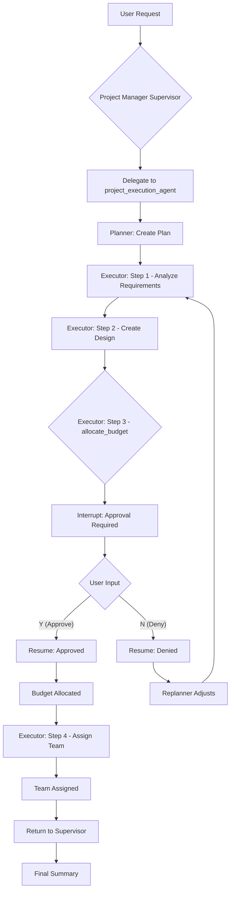

# Human-in-the-Loop: Supervisor with Plan-Execute-Replan Sub-Agent

This example demonstrates a **nested multi-agent architecture** combining the **Supervisor** pattern with **Plan-Execute-Replan** as a sub-agent, along with the **Approval** human-in-the-loop pattern.

It showcases how to build a hierarchical system where a project manager supervisor coordinates specialized agents, including a complex planning agent that requires user approval for sensitive operations like budget allocation.

## How It Works

1. **Nested Architecture**: A project manager supervisor manages two agents:
   - **research_agent**: A simple ChatModel agent for quick research tasks
   - **project_execution_agent**: A Plan-Execute-Replan agent for complex multi-step project tasks

2. **Plan-Execute-Replan Sub-Agent**: The `project_execution_agent` is itself a multi-agent system that:
   - **Plans**: Creates a step-by-step plan for the project
   - **Executes**: Executes each step using specialized tools
   - **Replans**: Adjusts the plan based on execution results

3. **Approvable Tool in Executor**: The executor within `project_execution_agent` has an `allocate_budget` tool wrapped in `InvokableApprovableTool`. When budget allocation is needed, an interrupt is triggered deep within the nested agent hierarchy.

4. **Workflow**:
   - User requests a complex project setup
   - Supervisor delegates to `project_execution_agent`
   - Planner creates a multi-step plan
   - Executor executes steps (analyze requirements, create design, etc.)
   - When `allocate_budget` is called → **interrupt for approval**
   - User approves or denies → resume
   - Remaining steps complete (team assignment)
   - Supervisor summarizes results

## Architecture Diagram

```
┌─────────────────────────────────────────────────────────────┐
│                    Project Manager Supervisor                │
│                                                             │
│  ┌──────────────────┐    ┌────────────────────────────────┐│
│  │  research_agent  │    │   project_execution_agent      ││
│  │                  │    │   (Plan-Execute-Replan)        ││
│  │  - search_info   │    │                                ││
│  │                  │    │  ┌─────────┐  ┌──────────┐     ││
│  │                  │    │  │ Planner │→ │ Executor │     ││
│  │                  │    │  └─────────┘  └────┬─────┘     ││
│  │                  │    │                    │           ││
│  │                  │    │       ┌────────────┴────────┐  ││
│  │                  │    │       │ Tools:              │  ││
│  │                  │    │       │ - analyze_requirements│ ││
│  │                  │    │       │ - create_design     │  ││
│  │                  │    │       │ - allocate_budget ⚠️│  ││
│  │                  │    │       │ - assign_team       │  ││
│  │                  │    │       └─────────────────────┘  ││
│  │                  │    │                                ││
│  │                  │    │  ┌───────────┐                 ││
│  │                  │    │  │ Replanner │                 ││
│  │                  │    │  └───────────┘                 ││
│  └──────────────────┘    └────────────────────────────────┘│
└─────────────────────────────────────────────────────────────┘
                              ⚠️ = Requires User Approval
```

## Practical Example

Here's what the nested interrupt flow looks like:

```
========================================
User Query: Set up a new project called "Customer Portal" for the engineering department.
This should include analyzing requirements, creating a design, allocating a budget of $150,000 
from engineering, and assigning a team of Alice, Bob, and Charlie starting from 2025-02-01.
========================================

name: project_manager
path: [{project_manager}]
action: transfer to project_execution_agent

name: Planner
path: [{project_manager} {project_execution_agent} {Planner}]
answer: Creating plan with steps:
1. Analyze requirements for Customer Portal
2. Create technical design
3. Allocate budget of $150,000 from engineering
4. Assign team members

name: Executor
path: [{project_manager} {project_execution_agent} {Executor}]
tool name: analyze_requirements
arguments: {"project_description":"Customer Portal for engineering department"}

name: Executor
path: [{project_manager} {project_execution_agent} {Executor}]
tool response: {"requirements":[...],"complexity":"Medium","estimated_hours":240}

name: Executor
path: [{project_manager} {project_execution_agent} {Executor}]
tool name: create_design
arguments: {"project_name":"Customer Portal","requirements":[...]}

name: Executor
path: [{project_manager} {project_execution_agent} {Executor}]
tool response: {"design_id":"DESIGN-1234","architecture":"Microservices",...}

name: Executor
path: [{project_manager} {project_execution_agent} {Executor}]
tool name: allocate_budget
arguments: {"project_name":"Customer Portal","amount":150000,"department":"engineering"}

========================================
APPROVAL REQUIRED
========================================
tool 'allocate_budget' interrupted with arguments '{"project_name":"Customer Portal","amount":150000,"department":"engineering"}'

Approve this budget allocation? (Y/N): Y

========================================
Resuming execution...
========================================

name: Executor
path: [{project_manager} {project_execution_agent} {Executor}]
tool response: {"allocation_id":"BUDGET-eng-5678","amount":150000,"status":"approved"}

name: Executor
path: [{project_manager} {project_execution_agent} {Executor}]
tool name: assign_team
arguments: {"project_name":"Customer Portal","team_members":["Alice","Bob","Charlie"],"start_date":"2025-02-01"}

name: Executor
path: [{project_manager} {project_execution_agent} {Executor}]
tool response: {"assignment_id":"TEAM-9012","status":"confirmed"}

name: project_manager
path: [{project_manager}]
answer: Project "Customer Portal" has been successfully set up...
```

This trace demonstrates:
- **Hierarchical Delegation**: Supervisor → Plan-Execute-Replan agent
- **Deep Nesting**: Interrupt occurs 3 levels deep (Supervisor → PlanExecute → Executor → Tool)
- **Plan Execution**: Multiple steps executed in sequence
- **Budget Approval**: Sensitive operation triggers interrupt
- **Seamless Resume**: After approval, execution continues from where it stopped

## How to Configure Environment Variables

Before running the example, you need to set up the required environment variables for the LLM API. You have two options:

### Option 1: OpenAI-Compatible Configuration
```bash
export OPENAI_API_KEY="{your api key}"
export OPENAI_BASE_URL="{your model base url}"
# Only configure this if you are using Azure-like LLM providers
export OPENAI_BY_AZURE=true
# 'gpt-4o' is just an example, configure the model name provided by your LLM provider
export OPENAI_MODEL="gpt-4o-2024-05-13"
```

### Option 2: ARK Configuration
```bash
export MODEL_TYPE="ark"
export ARK_API_KEY="{your ark api key}"
export ARK_MODEL="{your ark model name}"
```

Alternatively, you can create a `.env` file in the project root with these variables.

## How to Run

Ensure you have your environment variables set (e.g., for the LLM API key). Then, run the following command from the root of the `eino-examples` repository:

```sh
go run ./adk/human-in-the-loop/8_supervisor-plan-execute
```

You will see the project manager coordinating the project setup, and when budget allocation is attempted, you'll be prompted to approve or deny the financial operation.

## Workflow Diagram



## Key Concepts Demonstrated

| Concept | Description |
|---------|-------------|
| **Nested Multi-Agent** | Supervisor contains Plan-Execute-Replan as sub-agent |
| **Deep Interrupt** | Interrupt triggered 3 levels deep in agent hierarchy |
| **State Preservation** | Checkpoint store maintains state across all nested agents |
| **Seamless Resume** | Execution continues exactly where it was interrupted |
| **Plan-Execute-Replan** | Complex tasks broken into steps with replanning capability |
