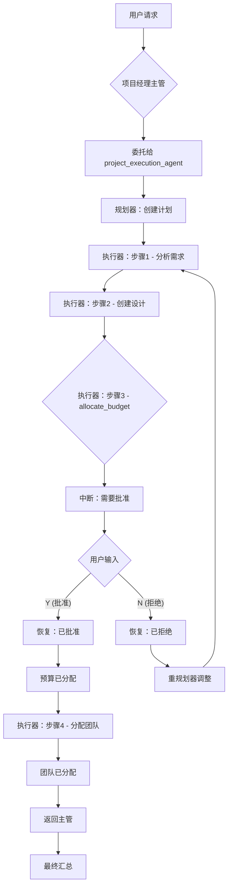

# 人机协同：Supervisor 与 Plan-Execute-Replan 子智能体

本示例演示了一个**嵌套多智能体架构**，将 **Supervisor** 模式与 **Plan-Execute-Replan** 作为子智能体相结合，并配合 **审批** 人机协同模式。

它展示了如何构建一个层级化系统，其中项目经理主管协调专业化智能体，包括一个需要用户批准敏感操作（如预算分配）的复杂规划智能体。

## 工作原理

1. **嵌套架构**：项目经理主管管理两个智能体：
   - **research_agent**：用于快速研究任务的简单 ChatModel 智能体
   - **project_execution_agent**：用于复杂多步骤项目任务的 Plan-Execute-Replan 智能体

2. **Plan-Execute-Replan 子智能体**：`project_execution_agent` 本身是一个多智能体系统：
   - **规划（Plans）**：为项目创建分步计划
   - **执行（Executes）**：使用专业化工具执行每个步骤
   - **重规划（Replans）**：根据执行结果调整计划

3. **执行器中的可审批工具**：`project_execution_agent` 内的执行器有一个被 `InvokableApprovableTool` 包装的 `allocate_budget` 工具。当需要预算分配时，会在嵌套智能体层级的深处触发中断。

4. **工作流程**：
   - 用户请求复杂的项目设置
   - 主管委托给 `project_execution_agent`
   - 规划器创建多步骤计划
   - 执行器执行步骤（分析需求、创建设计等）
   - 当调用 `allocate_budget` 时 → **中断以获取批准**
   - 用户批准或拒绝 → 恢复
   - 完成剩余步骤（团队分配）
   - 主管汇总结果

## 架构图

```
┌─────────────────────────────────────────────────────────────┐
│                    项目经理主管 (Supervisor)                  │
│                                                             │
│  ┌──────────────────┐    ┌────────────────────────────────┐│
│  │  research_agent  │    │   project_execution_agent      ││
│  │  (研究智能体)     │    │   (Plan-Execute-Replan)        ││
│  │                  │    │                                ││
│  │  - search_info   │    │  ┌─────────┐  ┌──────────┐     ││
│  │                  │    │  │ 规划器  │→ │  执行器  │     ││
│  │                  │    │  └─────────┘  └────┬─────┘     ││
│  │                  │    │                    │           ││
│  │                  │    │       ┌────────────┴────────┐  ││
│  │                  │    │       │ 工具:               │  ││
│  │                  │    │       │ - analyze_requirements│ ││
│  │                  │    │       │ - create_design     │  ││
│  │                  │    │       │ - allocate_budget ⚠️│  ││
│  │                  │    │       │ - assign_team       │  ││
│  │                  │    │       └─────────────────────┘  ││
│  │                  │    │                                ││
│  │                  │    │  ┌───────────┐                 ││
│  │                  │    │  │ 重规划器  │                 ││
│  │                  │    │  └───────────┘                 ││
│  └──────────────────┘    └────────────────────────────────┘│
└─────────────────────────────────────────────────────────────┘
                              ⚠️ = 需要用户批准
```

## 实际示例

以下是嵌套中断流程的示例：

```
========================================
User Query: Set up a new project called "Customer Portal" for the engineering department.
This should include analyzing requirements, creating a design, allocating a budget of $150,000 
from engineering, and assigning a team of Alice, Bob, and Charlie starting from 2025-02-01.
========================================

name: project_manager
path: [{project_manager}]
action: transfer to project_execution_agent

name: Planner
path: [{project_manager} {project_execution_agent} {Planner}]
answer: Creating plan with steps:
1. Analyze requirements for Customer Portal
2. Create technical design
3. Allocate budget of $150,000 from engineering
4. Assign team members

name: Executor
path: [{project_manager} {project_execution_agent} {Executor}]
tool name: analyze_requirements
arguments: {"project_description":"Customer Portal for engineering department"}

name: Executor
path: [{project_manager} {project_execution_agent} {Executor}]
tool response: {"requirements":[...],"complexity":"Medium","estimated_hours":240}

name: Executor
path: [{project_manager} {project_execution_agent} {Executor}]
tool name: create_design
arguments: {"project_name":"Customer Portal","requirements":[...]}

name: Executor
path: [{project_manager} {project_execution_agent} {Executor}]
tool response: {"design_id":"DESIGN-1234","architecture":"Microservices",...}

name: Executor
path: [{project_manager} {project_execution_agent} {Executor}]
tool name: allocate_budget
arguments: {"project_name":"Customer Portal","amount":150000,"department":"engineering"}

========================================
APPROVAL REQUIRED
========================================
tool 'allocate_budget' interrupted with arguments '{"project_name":"Customer Portal","amount":150000,"department":"engineering"}'

Approve this budget allocation? (Y/N): Y

========================================
Resuming execution...
========================================

name: Executor
path: [{project_manager} {project_execution_agent} {Executor}]
tool response: {"allocation_id":"BUDGET-eng-5678","amount":150000,"status":"approved"}

name: Executor
path: [{project_manager} {project_execution_agent} {Executor}]
tool name: assign_team
arguments: {"project_name":"Customer Portal","team_members":["Alice","Bob","Charlie"],"start_date":"2025-02-01"}

name: Executor
path: [{project_manager} {project_execution_agent} {Executor}]
tool response: {"assignment_id":"TEAM-9012","status":"confirmed"}

name: project_manager
path: [{project_manager}]
answer: Project "Customer Portal" has been successfully set up...
```

此跟踪记录展示了：
- **层级委托**：主管 → Plan-Execute-Replan 智能体
- **深度嵌套**：中断发生在智能体层级的第3层深处（主管 → PlanExecute → 执行器 → 工具）
- **计划执行**：多个步骤按顺序执行
- **预算批准**：敏感操作触发中断
- **无缝恢复**：批准后，执行从中断处继续

## 如何配置环境变量

在运行示例之前，您需要设置 LLM API 所需的环境变量。您有两个选项：

### 选项 1: OpenAI 兼容配置
```bash
export OPENAI_API_KEY="{your api key}"
export OPENAI_BASE_URL="{your model base url}"
# 仅在使用 Azure 类 LLM 提供商时配置此项
export OPENAI_BY_AZURE=true
# 'gpt-4o' 只是一个示例，请配置您的 LLM 提供商提供的实际模型名称
export OPENAI_MODEL="gpt-4o-2024-05-13"
```

### 选项 2: ARK 配置
```bash
export MODEL_TYPE="ark"
export ARK_API_KEY="{your ark api key}"
export ARK_MODEL="{your ark model name}"
```

或者，您可以在项目根目录创建一个 `.env` 文件来设置这些变量。

## 如何运行

确保您已设置好环境变量（例如，LLM API 密钥）。然后，在 `eino-examples` 仓库的根目录下运行以下命令：

```sh
go run ./adk/human-in-the-loop/8_supervisor-plan-execute
```

您将看到项目经理协调项目设置，当尝试进行预算分配时，系统会提示您批准或拒绝该财务操作。

## 工作流程图



## 演示的关键概念

| 概念 | 描述 |
|------|------|
| **嵌套多智能体** | 主管包含 Plan-Execute-Replan 作为子智能体 |
| **深度中断** | 中断在智能体层级的第3层深处触发 |
| **状态保持** | 检查点存储在所有嵌套智能体中维护状态 |
| **无缝恢复** | 执行从中断的确切位置继续 |
| **Plan-Execute-Replan** | 复杂任务分解为步骤，具有重规划能力 |
